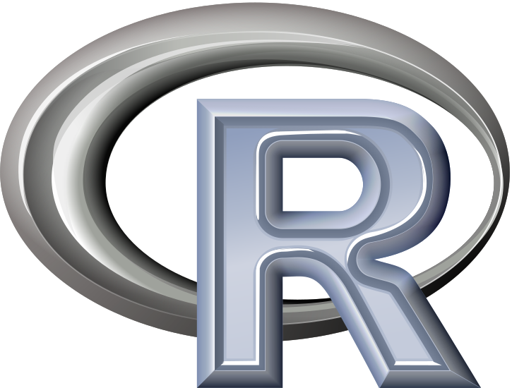

##

## Outline

Getting started

  - Installation of R, Rstudio,Using packages

Simple programming

  - Diving into R

Input/Output

  - getting data into and out of R

Working with data

  - All manner of data wrangling

Using and writing functions

  - Using R functions better, and writing your own

Control Flow and Iterative Programming

  - Standard statistical programming that can make many tasks easier

Basic Stats & Modeling

  - General Modeling approaches

Visualization

  - Focus on newer developments/approaches

Coding Style

  - Writing better code 

 

