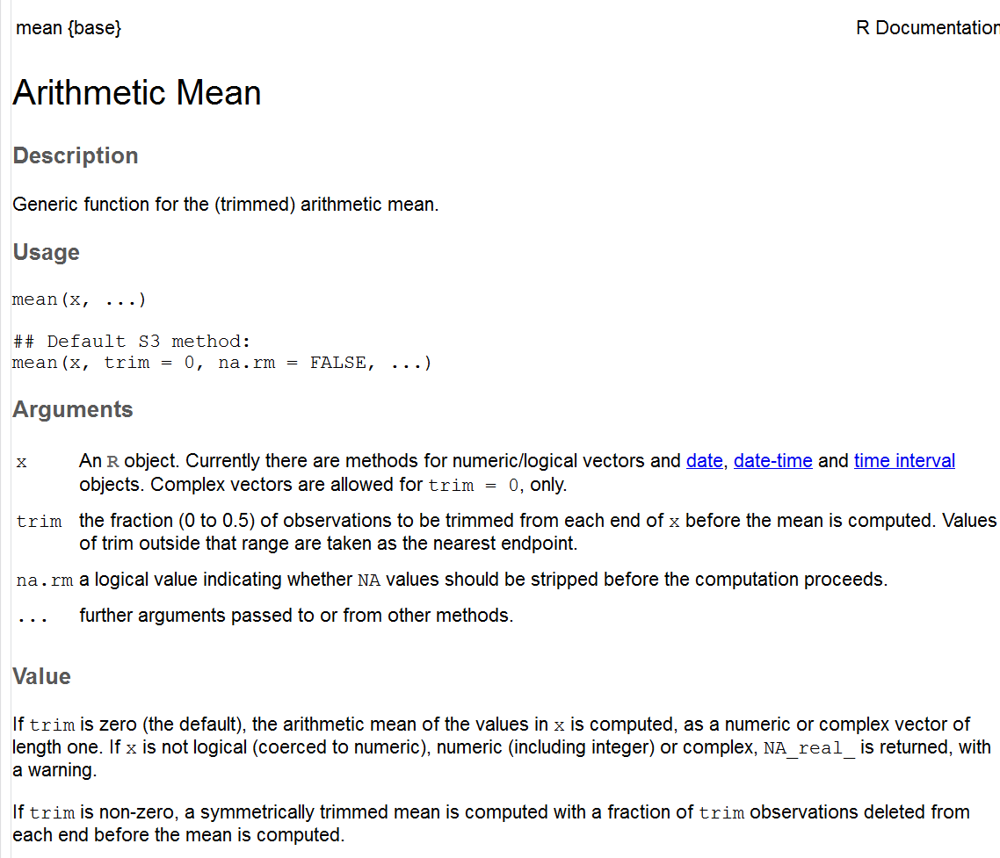

## Outline
Functions

- Review of using
- Writing your own

# <mark class="empTitle">Using functions</mark>
## Using functions

Functions are extremely important in the R world.

- they are themselves objects and can be used as such

The key thing to remember is that functions (almost always) take specific inputs and always return a value.

Every R helpfile states explicitly the syntax required to use a function

The basic components

- argument list
- body
- environment


## Arguments

Note that not all arguments are required, and some will have default values.

It is important to know the arguments of any function you use, or you might be missing out on quite a bit, or not understand why you're getting an error.

As an example, examine the arguments for the <mark class="empTitle">mean</mark> function (i.e. type ?mean for the help file)

<div style="text-align:center">

</div>

## Body

The body of a function is where all the code that works on those arguments

Type <mark class="empCode">median.default</mark> at your console to see the body of median, which is fairly simple as far as many functions go.

```{r median, cache=TRUE}
median.default
```


## Body
Note that many of R's core functions actually call other functions that are written in C for faster computation.

If they are written well, you will typically see much of the first part devoted to error checking.

A good way to start learning decent coding style is by looking at code from base R functions.


## Environment

The environment is the frame or map of the location of the function's variables.

Its purpose is primarily to bind names to a set of values.

What do you think these two functions will produce? Make your guess then see for yourself.

```{r enviro, eval=FALSE}
b = 3

f = function(b){
  return(b)
}

f(2)

f = function(a){
  return(b)
}

f(2)
```

## Environment

In the first case, the reason 2 is returned instead of 3 is because the first environment searched to locate b is the the one created by the function. As it is passed as an argument, the value associated with the argument is returned.

In the second case, b is not found in the current (function) environment, so the global environment is searched.

```{r, cache=TRUE, results='hold'}
f = function(){
  print(environment())
  # return(b)
}

f(); environment()
```

This will be more important when writing your own functions, and more so if you create your own package.

However, it's good to at least be aware of environments to better understand how functions are working when you use them.


# <mark class="empTitle">Writing your own functions</mark>
## Writing your own functions
Once you get the hang of R, you'll want to write your own functions to further make your data wrangling and exploration efficient.  

Furthermore, functions aid reproducibility and automaticity.

A simple rule is, if you've written the same line of code more than twice, you should probably write a function the does the operation you're attempting.


## Writing your own functions
And it doesn't have to be complicated.  

As noted, Functions take <mark class='emp'>arguments</mark> and return <mark class='emp'>values</mark>.

To create a function, we use the following approach:

```{r, eval=FALSE}
funcName = function(argsGoHere){
  Body
  .
  .
  .
  
  Value to be returned
}
```


## Writing your own functions

The following returns 'Positive' if the input is greater than zero, 'Negative' if not.

```{r posNegFunc, cache=TRUE}
posNeg = function(x){
  result = ifelse(sum(x) > 0, 'Positive', 'Negative')
  result
}

randomData = rnorm(10)
posNeg(x=randomData)
```

This does the job but could be made much better.  Can you think of any ideas for improvement?


## Writing your own functions
Suggestions: 
  
  - error handling
  - support for zero values
  - perhaps add an argument for converting to factor or binary
  

## Functionals

Remember that functions are objects.

 - As such, they can be passed as arguments to other functions, while still returning a vector of some kind

We will demonstrate some very important <mark class='emp'>*functionals*</mark> later.

At that point we will also see some <mark class='emp'>*anonymous functions*</mark>, in which we create a simple function on the fly.

There are also functions that return functions.


## Playtime: Create Your Own Function

Write a function that does the following:

Take an input and return a <mark class='empCode'>list</mark> object containing the <mark class='empCode'>mean</mark>, <mark class='empCode'>sd</mark>, and <mark class='empCode'>sum</mark>.

For the purposes of this exercise, in the body of the function create separate objects for each thing to return, and combine them into a list.

Use a snippet to get started (type fun and hit tab).


## Debugging
Rstudio's debugger makes also makes testing very easy.

As an example, one can use a function like <mark class='empCode'>debugonce</mark> to start the debugging process.

```{r, eval=FALSE}
debugonce(myfunc)
myfunc(arg)
```

Try it with the function you just created. Hit return (at the console) to cycle through your function step by step.


