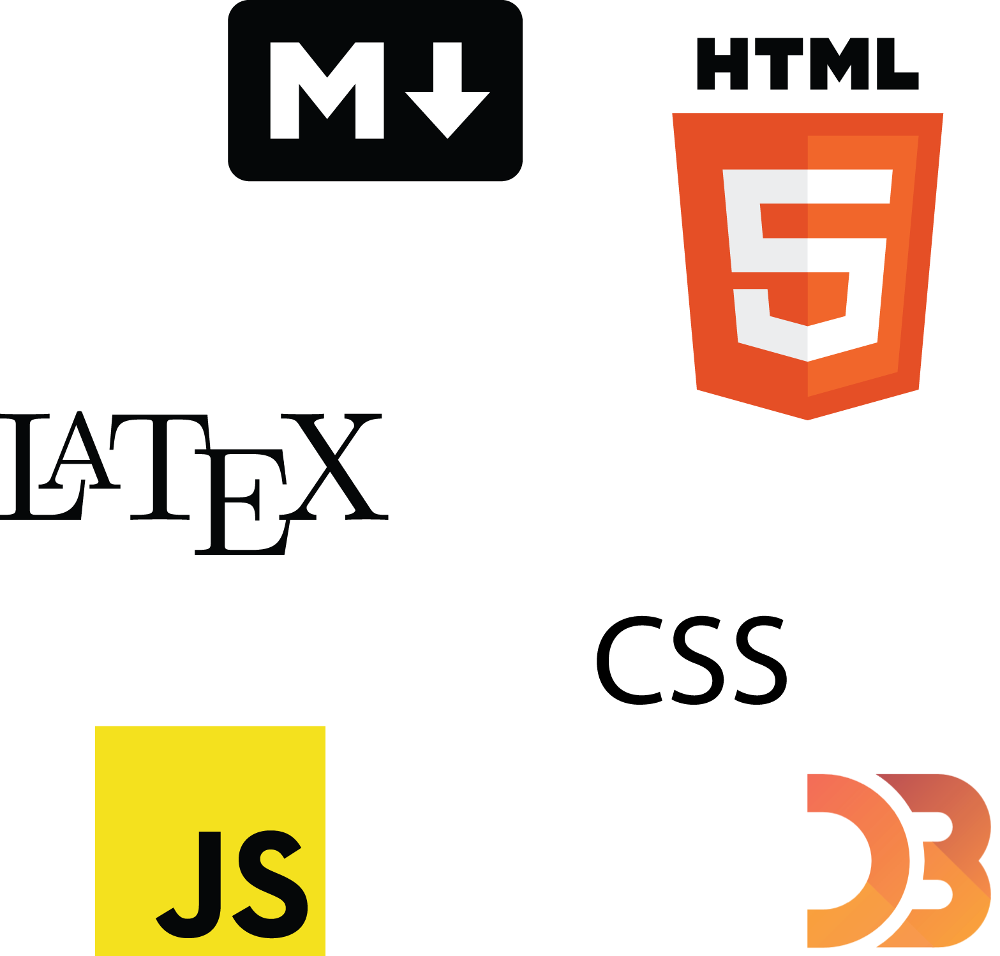
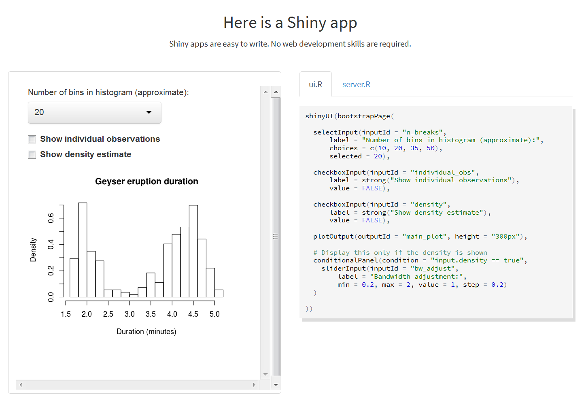
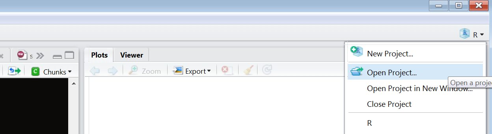

## Outline
- Installing R
- Installing Rstudio
    - Getting to know the power of Rstudio
- Installing additional functionality


## What is R?

R is a programming language (Gnu-S)

R is an environment for statistical computing and graphics

R is not a "stats package"

It is never useful to ask if you can do something in R.  

- R's only limitation is your programming ability and creativity.


## Installing R

Installing R

- Pick a mirror (closer better but doesn't really matter.  0-Cloud is fine.)
- Pick an OS
  - Windows: Download base
  - MAC: first .pkg file
  - Linux: follow instructions according to your flavor

You now have a fully functioning statistical programming environment.

However... you will likely never need to use base R directly


## Installing Rstudio

Installing Rstudio

Cross-platform

 - Go to website
 - Download
 - Install
 
# <mark class="empTitle">Using Rstudio</mark>
## What is Rstudio?
<mark class="emp">I</mark>ntegrated <mark class="emp">D</mark>evelopment <mark class="emp">E</mark>nvironment


## Using Rstudio

Making programming easier

- Code completion
- Keyboard shortcuts
- Debugging

But lots more...


## Using Rstudio

- <mark class='emp'>**Web-enabled**</mark>
    - Interactive graphics
    - Create webpages, presentations (like this one) and more
- <mark class='emp'>**Projects**</mark>
- <mark class='emp'>**Built in version-control**</mark>
- Package development


## Using other code, Reporting tools

<div class="columns-2">
- R scripts
- R markdown
- Latex 
- Presentation
- General text/code editor that recognizes several other languages

<div style="text-align:center">

</div>

</div>

## Web-enabled

Not only can you easily publish your efforts to html, you can even code directly in html, css, javascript etc.

The Rstudio group and others have a suite of packages devoted to interactive visualizations that often will require no more effort than standard plots.

<div style="text-align:center">

</div>

## Projects

Projects are a way to keep you research focused

Easily pick up where you left off

Easily switch from one project to another

Version control

<div style="text-align:center">

</div>


## Version Control

Any project is able to take advantage of version control

- Git
- SVN

Among the many benefits, version-control provides peace of mind for research reproducibility, enhances collaboration, and allows one to keep on top of all the changes a typical research endeavor undergoes.

<div style="text-align:center">

</div>


# <mark class="empTitle">Adding Functionality</mark>

## Adding Functionality

R's true power comes from the thousands of packages produced by the statistical and greater research communities

At this point there is a package for practically everything you'd want to do, especially when it comes to modeling

The best part is that adding this functionality is very easy

## Installing Packages

CRAN

  - Comprehensive R Archive Network
  - Main place for R packages
  
Other

  - Github (also Rforge R-forge)
  - Bioconductor

To install packages there are two primary approaches within Rstudio:

  - install.packages function
  - Using the packages tab
  
## Using Packages

R does not load packages in your library automatically. To do so, use the library function to select the package.

  - library('packagename')

To remove a package you've loaded from the global environment:

  - detach(package:packagename)

Common coding practice loads a package only at the point it's needed (rather than loading all at the beginning)

## Using packages

Let's go ahead and install and load a package

Type the following at the R console, or use the GUI approach.

```{r eval=FALSE}
install.packages('dplyr')
install.packages('ggvis')
```

Note how any dependencies are installed automatically.

If you are prompted to choose a mirror, select 0-cloud.

<mark class="empPack">dplyr</mark>  will take a bit because one of the dependencies is relatively large.
